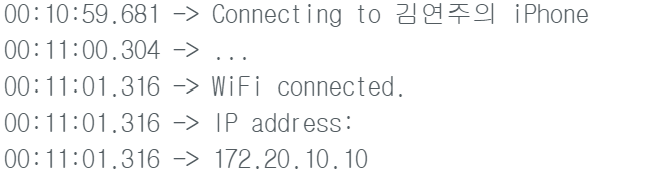
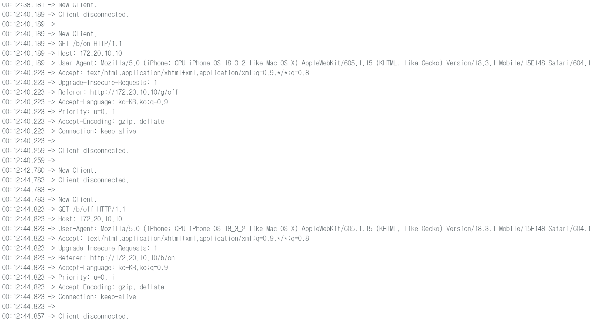
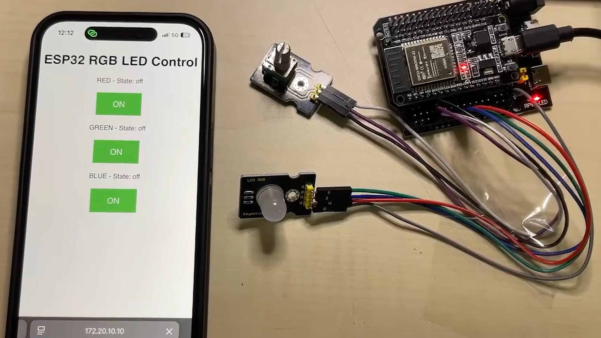

# IoT25-HW06
Assignment 6. ESP32 Web Server

---

## Result
### Arduino Screenshot



### photo of the deployment

### test/demo
(https://youtu.be/H_03G_sPb6s?si=GPcZ28mnbbkFivba)
---

## Source code
```cpp
#include <WiFi.h>

// Wi-Fi 정보 입력
const char* ssid = "김연주의 iPhone";
const char* password = "12345678";

WiFiServer server(80);
String header;

String rState = "off";
String gState = "off";
String bState = "off";

const int redPin = 26;
const int greenPin = 27;
const int bluePin = 25;

unsigned long currentTime = millis();
unsigned long previousTime = 0;
const long timeoutTime = 2000;

void setup() {
  Serial.begin(115200);
  pinMode(redPin, OUTPUT);
  pinMode(greenPin, OUTPUT);
  pinMode(bluePin, OUTPUT);

  digitalWrite(redPin, HIGH);
  digitalWrite(greenPin, HIGH);
  digitalWrite(bluePin, HIGH);

  Serial.print("Connecting to ");
  Serial.println(ssid);
  WiFi.begin(ssid, password);

  while (WiFi.status() != WL_CONNECTED) {
    delay(500);
    Serial.print(".");
  }

  Serial.println("");
  Serial.println("WiFi connected.");
  Serial.println("IP address: ");
  Serial.println(WiFi.localIP());

  server.begin();
}

void loop() {
  WiFiClient client = server.available();
  if (client) {
    currentTime = millis();
    previousTime = currentTime;
    Serial.println("New Client.");
    String currentLine = "";

    while (client.connected() && currentTime - previousTime <= timeoutTime) {
      currentTime = millis();
      if (client.available()) {
        char c = client.read();
        Serial.write(c);
        header += c;

        if (c == '\n') {
          if (currentLine.length() == 0) {
            client.println("HTTP/1.1 200 OK");
            client.println("Content-type:text/html");
            client.println("Connection: close");
            client.println();

            // 제어 요청 처리
            if (header.indexOf("GET /r/on") >= 0) {
              rState = "on";
              digitalWrite(redPin, LOW);
            } else if (header.indexOf("GET /r/off") >= 0) {
              rState = "off";
              digitalWrite(redPin, HIGH);
            } else if (header.indexOf("GET /g/on") >= 0) {
              gState = "on";
              digitalWrite(greenPin, LOW);
            } else if (header.indexOf("GET /g/off") >= 0) {
              gState = "off";
              digitalWrite(greenPin, HIGH);
            } else if (header.indexOf("GET /b/on") >= 0) {
              bState = "on";
              digitalWrite(bluePin, LOW);
            } else if (header.indexOf("GET /b/off") >= 0) {
              bState = "off";
              digitalWrite(bluePin, HIGH);
            }

            // HTML 페이지 출력
            client.println("<!DOCTYPE html><html><head>");
            client.println("<meta name=\"viewport\" content=\"width=device-width, initial-scale=1\">");
            client.println("<style>html{font-family:Helvetica;text-align:center;} .button{background-color:#4CAF50;border:none;color:white;padding:16px 40px;font-size:20px;cursor:pointer;margin:5px;} .button2{background-color:#555555;}</style>");
            client.println("</head><body><h1>ESP32 RGB LED Control</h1>");

            // R
            client.println("<p>RED - State: " + rState + "</p>");
            if (rState == "off") {
              client.println("<p><a href=\"/r/on\"><button class=\"button\">ON</button></a></p>");
            } else {
              client.println("<p><a href=\"/r/off\"><button class=\"button button2\">OFF</button></a></p>");
            }

            // G
            client.println("<p>GREEN - State: " + gState + "</p>");
            if (gState == "off") {
              client.println("<p><a href=\"/g/on\"><button class=\"button\">ON</button></a></p>");
            } else {
              client.println("<p><a href=\"/g/off\"><button class=\"button button2\">OFF</button></a></p>");
            }

            // B
            client.println("<p>BLUE - State: " + bState + "</p>");
            if (bState == "off") {
              client.println("<p><a href=\"/b/on\"><button class=\"button\">ON</button></a></p>");
            } else {
              client.println("<p><a href=\"/b/off\"><button class=\"button button2\">OFF</button></a></p>");
            }

            client.println("</body></html>");
            client.println();
            break;
          } else {
            currentLine = "";
          }
        } else if (c != '\r') {
          currentLine += c;
        }
      }
    }

    header = "";
    client.stop();
    Serial.println("Client disconnected.");
    Serial.println("");
  }
}
